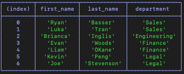

# employee-tracker

## License

[](https://opensource.org/licenses/MIT)

https://opensource.org/licenses/MIT


## Table of Contents
* [Description](#description) 
* [User Story & Criteria](#userstory)
* [Installation Instructions](#installation)
* [Usage Instructions](#usage)
* [Contribution Guide](#contribute)
* [Tests](#tests)
* [Questions](#questions)


## Description
This project is an business management application that allows a user to interact with a mysql database that includes departments, roles and employees that exist in the company. The application is built using `Nodejs`, `Inquirer`, `console.table` and `mysql`.

When a user starts the application, they are presented with a series of prompts, ranging from viewing database information to changing or deleting information. 


After selecting a prompt, the application will handle the user request by querying the database and returning the data in a `console.table` command for easy reading. An example output is below:



After the output is returned, the application will provide the user with another opportunity to select a new way to interact with the database - the same way that the user is prompted when the application is first started.

When the user is done with the applications, they can exit using the command `control + c`.

All of the base acceptance criteia has been met, along with 5 bonus criteria: Budget per department, delete department, delete role, delete employee, view employees by department.

### Video Demo
A video demonstation of the app can be viewed here: https://drive.google.com/file/d/1ypd0tby7k_-Sk0QkADHZ7gEDOz0Efrb5/view


## User Story

```md
AS A business owner
I WANT to be able to view and manage the departments, roles, and employees in my company
SO THAT I can organize and plan my business
```

## Acceptance Criteria

```md
GIVEN a command-line application that accepts user input
WHEN I start the application
THEN I am presented with the following options: view all departments, view all roles, view all employees, add a department, add a role, add an employee, and update an employee role
WHEN I choose to view all departments
THEN I am presented with a formatted table showing department names and department ids
WHEN I choose to view all roles
THEN I am presented with the job title, role id, the department that role belongs to, and the salary for that role
WHEN I choose to view all employees
THEN I am presented with a formatted table showing employee data, including employee ids, first names, last names, job titles, departments, salaries, and managers that the employees report to
WHEN I choose to add a department
THEN I am prompted to enter the name of the department and that department is added to the database
WHEN I choose to add a role
THEN I am prompted to enter the name, salary, and department for the role and that role is added to the database
WHEN I choose to add an employee
THEN I am prompted to enter the employee’s first name, last name, role, and manager, and that employee is added to the database
WHEN I choose to update an employee role
THEN I am prompted to select an employee to update and their new role and this information is updated in the database 
```


## Installation
To Install and run this application yourself, follow the below step(s).

    npm i


## Usage
install the applicaiton dependancies using the above command, initialize the database in mysql by running `mysql -u <user> -p <password>`. Then, `source db/schema.sql` followed by `source db/seeds.sql`. Now that the database is initialized, run `npm start` to run the CLI application and interacti with it as you wish.


## Contribute
This app has been finished and does not require any further development.


## Tests
This app does not have any tests.


## Questions
For any questions about the code please see my github for source code, email me at the address provided, or find my social media links on my portfolio website. 
* https://github.com/EvanCWoods
* evan.woods.dev@gmail.com
* https://evancwoods.github.io/Evan-Woods-Portfolio/
